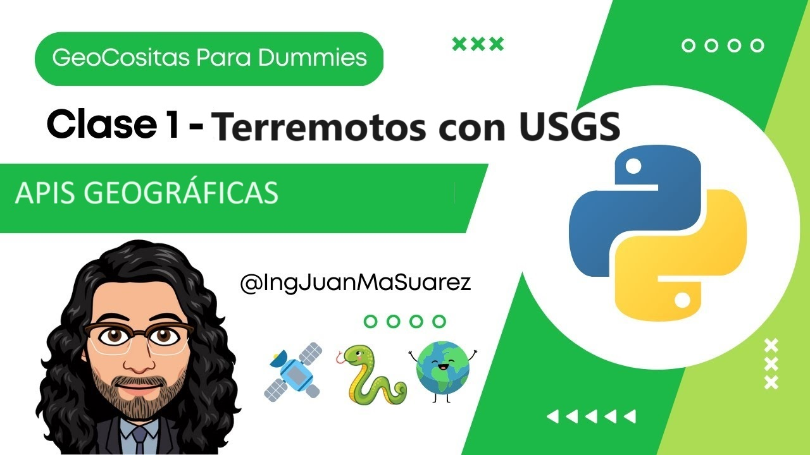

# APis Geograficas para Dummies

## Curso para aprender sobre APIs geográficas, que son y como se utilizan con diferentes lenguajes de programación desde cero y para principiantes

## Clases en vídeo

### Curso de fundamentos de estas librerías desde cero

Curso que agrupa todas las clases que hacen referencia a los fundamentos de Leaflet, Mapbox y Open Layers.

> Código: Todo el código se encuentra en la raiz de este repositorio de Github

* [Lección 1 - Python y Folium para Principiantes: Cómo Mapear Terremotos con la API del USGS](https://youtu.be/dMA9pYiwZh4)
* 02 - Cómo Hacer un Mapa de Temperatura y Clima con Python y la API de OpenWeatherMap 🌍🌞
* [Lección 3 - Transforma Direcciones en Mapas: Geocodificación con JavaScript, HERE Maps y Mapbox](https://youtu.be/2RATxl59X6E)

## Enlaces de interés

* [Web oficial del Servicio Geológico de los Estados Unidos](https://www.usgs.gov/)
* [Web oficial de Folium](https://python-visualization.github.io/folium/latest/)
* [Web oficial de OpenWeatherMap](https://openweathermap.org/)
* [Web oficial de Here](https://www.here.com/)

#### Puedes apoyar mi trabajo haciendo "☆ Star" en el repo o nominarme a "GitHub Star". ¡Gracias!

